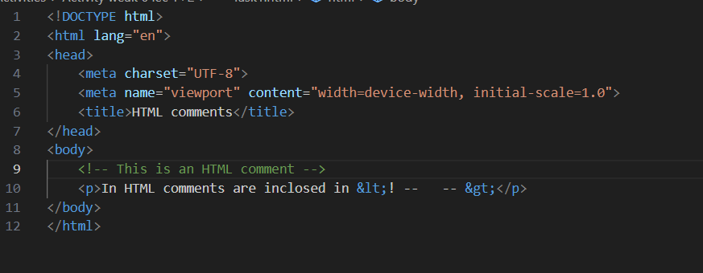
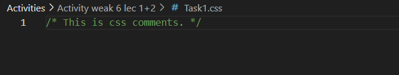
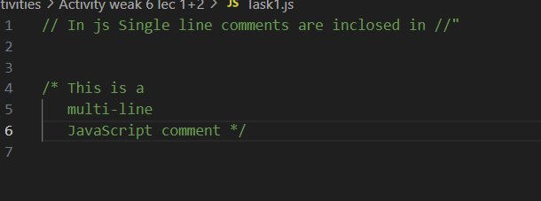
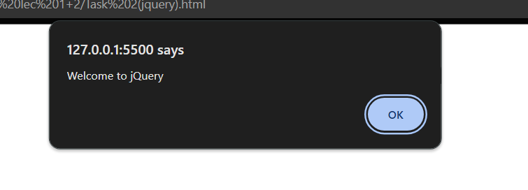
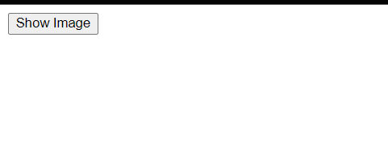
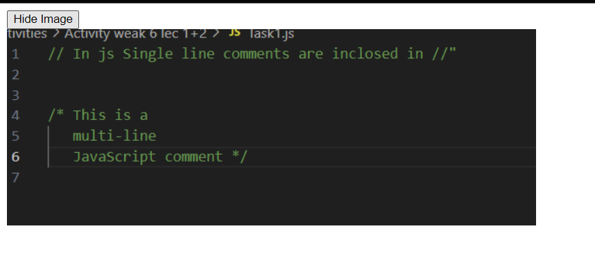
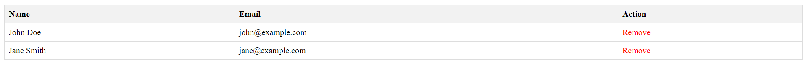
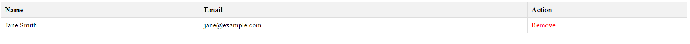
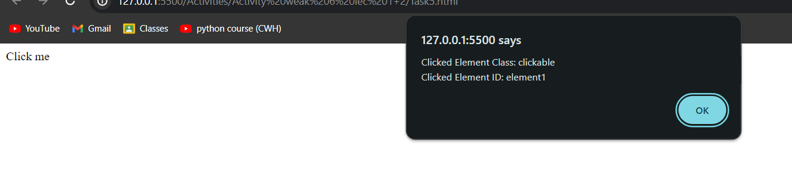
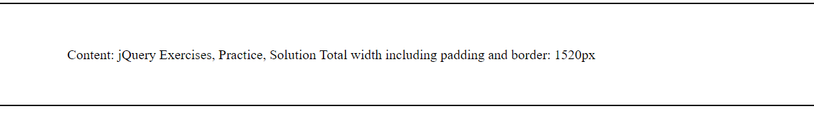

<h1> Weak 6 lec 1+2 ACTIVITY</h1>
<h3>Task 1 is all about comments in HTML,CSS and JS</h3>

 

 

<h3>Task 2 (jquery)</h3>

<h3>Task 2 (CDN)</h3>

<h3>Task 3</h3>

<h3>Task 4</h3>

Before removal

After removal

<h3>Task 5</h3>

<h3>Task 6</h3>

